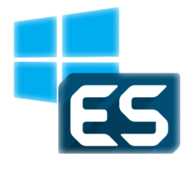

EmulationStation configured for Windows
======


An auto-installer to set up Emulation Station correctly on a 64-bit version of Windows 10/11


Features
------
- Uses an up to date version of Emulation Station from the Raspberry Pi branch
- Auto populates emulators with public domain roms
- Adds exclusive Windows only Emulators and Themes for the Switch, Wii-U and PS3
- Auto installs a popular theme with support for adding 'Favorites'
- Adds multiple useful shortcuts to the user's Desktop
- Adds in a game content scraper which lives in (run %UserProfile%\\.emulationstation\roms\scraper.exe)


Steps
------
- Single one liner to install everything:
```
if (-Not (Test-Path C:\temp\es-setup)) { mkdir C:\temp\es-setup }; Set-Location C:\temp\es-setup\;Set-ExecutionPolicy Bypass -Scope Process -Force;[Net.ServicePointManager]::SecurityProtocol = [Net.SecurityProtocolType]::Tls12;Invoke-WebRequest "https://github.com/Francommit/win10_emulation_station/archive/1.4.0.zip" -OutFile "emulationStation.zip";Expand-Archive .\emulationStation.zip;cd .\emulationStation; cd .\win*;.\prepare.ps1
```
- Script complete when powershell spits out:
```
INFO: Setup completed
```

#### Installation GIF:


Troubleshooting
------
- If you get an error saying "msvcr100.dll was not found" run `choco install vcredist2010 -y` from Powershell as admin
- If the controller is not working in game, configure Input in Retroarch (%UserProfile%\\.emulationstation\systems\retroarch\retroarch.exe)
- PSX, PS2 and PS3 Homebrew Games won't load unless you acquire the bios's and add them to the bios folder (%UserProfile%\\.emulationstation\systems\epsxe\bios and %UserProfile%\\.emulationstation\systems\pcsx2\bios)
- PSX, PS2 and PS3 also require manual configuration for controllers (%UserProfile%\\.emulationstation\systems\epsxe\ePSXe.exe and %UserProfile%\\.emulationstation\systems\pcsx2\pcsx2.exe and %UserProfile%\\scoop\apps\rpcs3\current)
- If the script fails for whatever reason delete the contents of %UserProfile%\\.emulationstation and try again.
- Emulation Station may crash when you return to it from a external progam, ensure your graphics drivers are up to date.
- Launching a Retroarch rom may return you to ES, you're probably on a 32-bit verison of Windows and need to acquire seperate cores.
- Powershell commands may fail, ensure your Powershell session is in Admin mode.
- If Powershell complains about syntax you're probably somehow running a Powershell version lower than 5. Run 'choco install powershell -y' to update.
- If you are using Xbox controllers and having trouble setting the guide button as hotkey, locate the file (%UserProfile%\\.emulationstation\es_input.cfg and change the line for hotkeyenable to ```<input id="5" name="hotkeyenable" type="button" value="10" />```
- The script is now re-runnable, so if anything fails, re-run it and it'll pick itself back up if your internet has died half-way through
- If you are unable to run script from context menu (right mouse button), revert default "Open with" to Notepad

#### Windowed Mode Execution:


Optional Features and Tips
------
- If you prefer to run your scripts via context menu (right mouse button) but lack the abilitiy to run them in an admin session, you can just double-click the "powershell_run-as-admin.reg" file and accept the registry modification. It will add a new entry to the menu to do that easily.
- If you use OneDrive to store your ROMs and saves, you can run the script onedrive.ps1 or you can modifify it to any other specific folder. Further instructions in comments
- Some new themes shows videos: [es-theme-crt](https://github.com/PRElias/es-theme-crt)
- Script for easy scraping included. Just run and it will backup your gamefile.xml for each ROM folder and produce a new one with data from scrap services (if you have modified your ROM folder, please check before run)

Old Steps
------
1. Run prepare.ps1 in an admin session of Powershell:
- Powershell might restart your computer as some libraries require a restart, if so, simply re-run after your PC restarts)
- You might need to change your Powershell execution policy, so run this __instead__ of JUST prepare.ps1
- ``Set-ExecutionPolicy Bypass -Scope Process -Force; .\prepare.ps1``

2. Launch Emulation Station and Enjoy

3. Access your ROMS here %UserProfile%\\.emulationstation\roms

Installation GIF old:


Translations
------
[Portuguese](https://github.com/Francommit/win10_emulation_station/blob/master/misc/translations/README.pt-br.md)

Special Thanks
------
- jrassa for his up to date compiled version of Emulation Station - https://github.com/jrassa/EmulationStation
- borger for his scoop emulator setup https://github.com/borger/scoop-emulators
- Nesworld for their open-source NES roms - http://www.nesworld.com/
- Libretro for their retroarch version - https://www.libretro.com/
- dtgm for maintaining the Emulation Station chocolatey package https://chocolatey.org/packages/emulationstation
- OpenEmu for their Open-Source rom collection work https://github.com/OpenEmu/OpenEmu-Update
- fonic for his theme https://github.com/fonic/recalbox-backport
- sselph for his awesome scraper https://github.com/sselph/scraper
- PRElias for Portuguese translations, choco auto-intall and new optional features - http://paulorobertoelias.com
